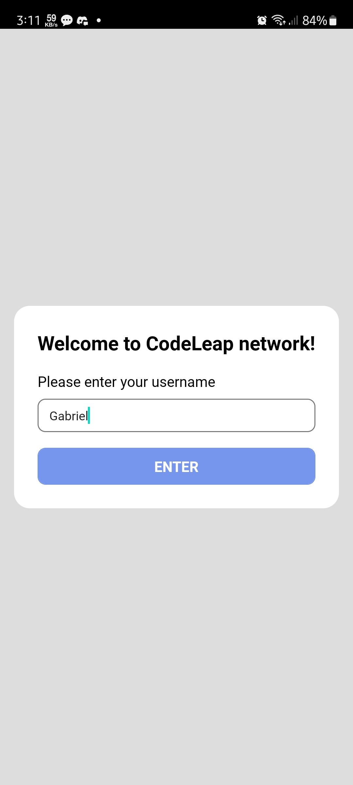

p# Junior Frontend Engineer Test - Codeleap

Coding test for the Junior Frontend Engineer position at Codeleap, made using React Native with Expo.

## 📱 Screenshots

- Sign Up
  
   
- List Posts
  
   
- New Post
  
   
  
- Edit Item Modal
   
- Delete Item Modal
  

## ⚙️ Installation and Setup

To install and run the app, follow these steps:

1. Clone the repository
2. Install dependencies with `npm install`
3. Run the app with `expo start`

## 💡 Features

- Create Post
- Edit Post
- Delete Post
- List Posts
- Persist user (store user "session" using Async Storage)
- Infinite Scroll

## 🛠️ Dependencies

- react-native-async-storage
- reduxjs/toolkit
- dayjs
- axios
- react-native-modal
- styled-components
- react-redux
